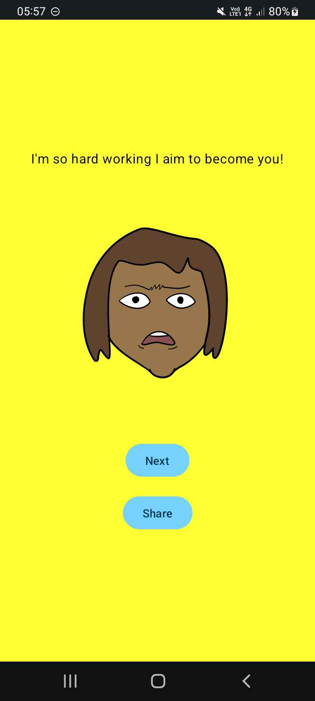
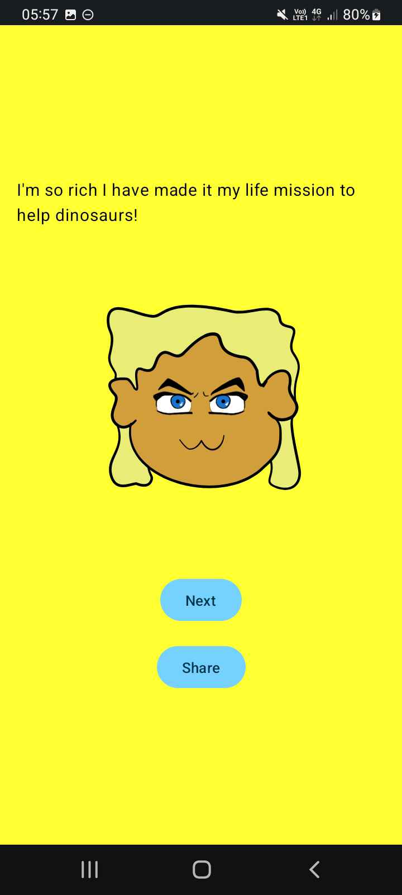

🌱 A small app project for fun and for learning to work with Kotlin in Android Studio  

 
  
  
🌱 Todo:  
[ ] mute button  
[ ] swipe to create new friend  
[ ] log like/dislike stats  
[ ] show like/dislike stats  