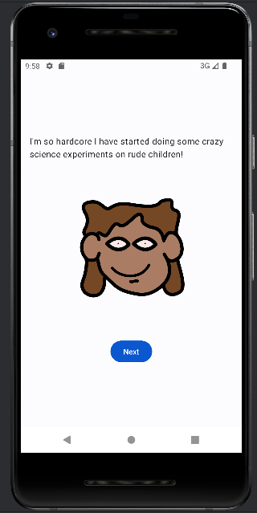

A small app project for fun and for learning to work with Kotlin in Android Studio 🌱

  
🌱 Todo:  
[ ] have image assets i folders instead of hardcoded  
[ ] swipe to create new friend (or remove swipe)  
[ ] mute button  
[ ] start page  
[ ] build and share for feedback  